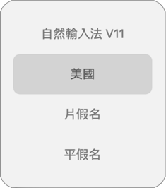
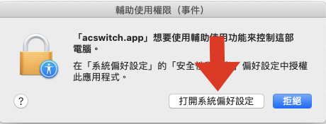
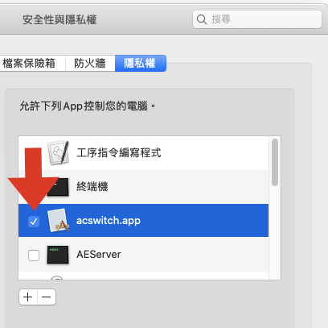
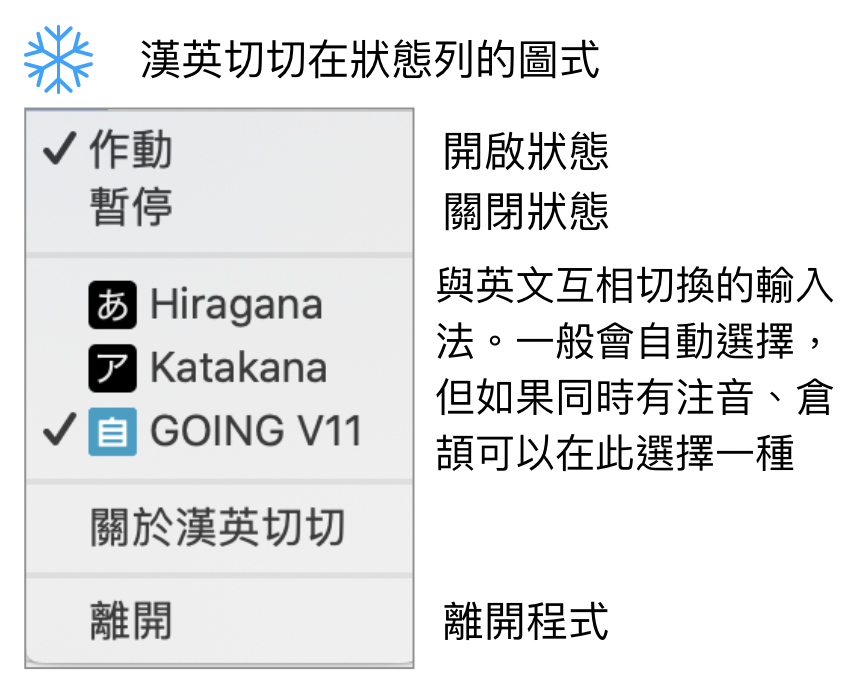

.. _h284d41787f652297372402e4132151e:

「漢英切切」MacOS App 
######################

「漢英切切」是安裝在MacOS (桌機、筆電）的app。安裝之後，連續按兩下空白鍵(Spacebar)會在英文與中文輸入法之間切換。

.. _h57574e4f5e306a1f6a391d2041155b23:

什麼人需要「漢英切切」？
************************

經常需要中英文夾雜輸入的人。如果你跟作者一樣，安裝好幾個輸入法，經常需要各種輸入法之間切換中文與英文，經常按到手指打結的話。例如，當你有四種輸入法時，目前需按下command + space 帶出選單，然後連續切換到所要中文或英文輸入法。改用「漢英切切」只要「一個空白鍵」連續按兩下就能切換。

\ |IMG1|\ 

.. _h174fb648377959437b5c1f697c1c40:

安裝方式
********

1. 按此下載後執行，跳出以下對話框時，選擇「打開系統偏好設定」

\ |IMG2|\ 

2. 勾選同意「漢英切切(acswitch)」使用「安全性與隱私權／輔助使用」功能。（你也可以直接把「漢英切切」的app檔案拖進那個框框裡面去）

\ |IMG3|\ 

3. 勾選完成後，請重新執行「漢英切切」。即可在狀態列看見「漢英切切」的圖示。

\ |IMG4|\ 。看見此圖示表示安裝成功，可以開始使用「漢英切切」。

.. _h174fb648377959437b5c1f697c1c40:

使用方式
********

連續按兩下空白鍵（在1／4秒內）即會在中文與英文輸入法之間接換。

如果需連續輸入超過兩個以上的空白時，直接連續輸入即可（按著空白鍵不放），連續輸入三個以上的空白時，「漢英切切」會自動判斷不會做切換。

.. _h2164242e4c6048506f23311549231654:

選單功能說明
************

\ |IMG5|\ 

.. bottom of content

